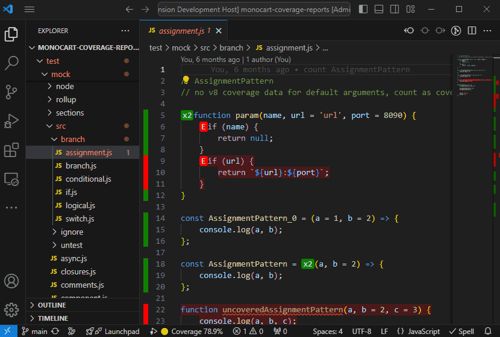

# Monocart Coverage for VSCode

This extension shows native V8 code coverage in VSCode



## Getting Started

Requirements: this extension works with [monocart-coverage-reports](https://github.com/cenfun/monocart-coverage-reports)

Install `monocart-coverage-reports` and generate `coverage-report.json` file with `v8-json` report.

```js
const coverageOptions = {
    // ...
    reports: ['v8-json']
    // ...
}
```
