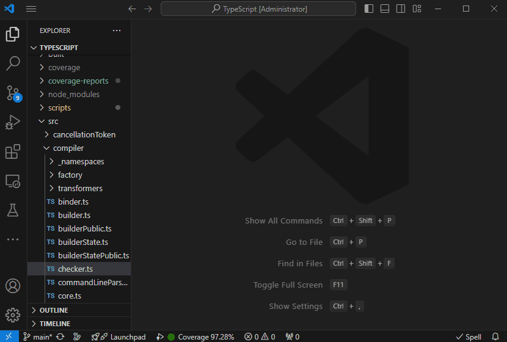

# Monocart Coverage for VSCode

This extension shows native V8 code coverage in VSCode


## Getting Started

Requirements: this extension works with [monocart-coverage-reports](https://github.com/cenfun/monocart-coverage-reports)

Install `monocart-coverage-reports` and generate `coverage-report.json` file with `v8-json` report.

```js
const coverageOptions = {
    // ...
    reports: ['v8-json']
    // ...
}
```

## Performance

Test with `TypeScript` project, open the file `checker.ts` (52K+ lines)




## Coverage for Test Runner

VSCode officially supports coverage view for the test runner, see [test-coverage](https://code.visualstudio.com/api/extension-guides/testing#test-coverage), I've tried adding V8 coverage data for the test runner, but it didn't luck. Maybe someone can help.